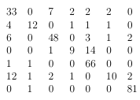

# Computer-Vision-IN4393 #

## Human Emotion Recognition ##

The problem encountered in this project is emotion recognition based on human faces. From a video the (changing) emotion of the human visible in the video should be recognized. Emotion recognition can be used in a lot of applications. For example product testing can be made a lot easier by using emotion recognition. A new product can be given to a user, and by using emotion recognition it can be reduced whether the user likes the product. This method is very cheap, and also very reliable since the user cannot lie.

### Methods ###

1. **Facial Landmark Detection**

In order to detect the emotion of a human, first the face needs to be detected. The face detector is made using the Histogram of Oriented Gradients (HOG) feature, a linear classifier, an image pyramid and a sliding window detection scheme. An ensemble of regression trees is used to regress the location of the facial landmarks.

2. **Feature Extraction**

- Geometric-based Features

Using the coordinates of different parts of the face different geometrical features are calculated. They include the area of the mouth and the eyes as well as the perimeter of the mouth and the eyes. This geometric-based feature is based on the [paper](https://www.researchgate.net/publication/308043138_Human_Mood_Classification_Based_on_Eyes_using_Susan_Edges) 

- Texture-based Features

To compute the texture based features, the face images is divided into number of cells or sub-images. Then [LBP operator](https://link.springer.com/chapter/10.1007/978-3-540-24670-1_36) is implemented on each cells. Each LBP histogram from each cell is concatenated to form a feature vector.

- Concatenated Features

[Paper](https://link.springer.com/chapter/10.1007/978-981-10-2104-6_55) shows that using only geometric-based features is not good enough to distinguish all emotion classes. LBP histograms contain information about the distribution of micro-patterns such as edges, flat areas and wrinkles which represent some finer details of the face. By combining geometrical based and texture based features the expectation is that the performance of the classifier will be improved.

3. **SVM Classifier**. 

The SVM multiclass classifier from [dlib](http://www.dlib.net) was used for classification.

### Dataset ###

The [Cohn-Kanade dataset](http://www.consortium.ri.cmu.edu/ckagree/) was used in the experiments for training and testing the classifier. It contains 327 images of faces, with corresponding labels. The possible labels are: surprise, sadness, happiness, fear, disgust, neutral and anger.

### Results ###

Columns 1 to 7 and rows 1 to 7 correspond to the emotions anger, neutral, disgust, fear, happiness, sadness and surprise respectively. Experiments based on 2-fold crossvalidation and based on live emotion recognition have been done.

For concatenated features, six geometric features is combined with uniform pattern LBP histogram with 7x4 number of cells. The result of this combination is displayed by the confusion matrix below.

The confusion matrix shows that classifying class 2, 4 and 6 is successfully increased compared to only using geometrically based features. Moreover, it also can improve  geometric or texture based feature the classifier performance on classes 1 and 3.  

### Conclusion ###

In conclusion, several feature extraction algorithms are applied in our project, i.e. geometry-based features, texture-based features, and concatenated features in order to classify human emotion. Using 2-fold cross validation, it was found that geometry-based feature extraction is best in classifying anger, disgust, happy and surprise, texture-based feature extraction is better in classifying neutral, fear and sad emotion compared to geometry-based, and concatenated features can improve the classifier performance for all classes. 